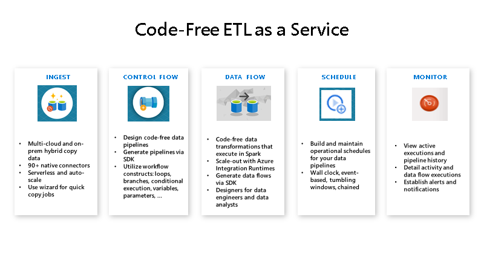

# Consume data from API using Azure Functions

## Azure Data Factory integration with Azure Functions
In this workshop we will use [Azure Data Factory](https://docs.microsoft.com/en-us/azure/data-factory/introduction) and [Azure Functions](https://docs.microsoft.com/en-us/azure/azure-functions/functions-overview) to copy, prepare and enrich data.

Azure Data Factory is a cloud-based ETL and data integration service that allows you to create data-driven workflows for orchestrating data movement and transforming data at scale.  Using Azure Data Factory, you can create and schedule data-driven workflows (called pipelines) that can ingest data from disparate data stores.

Azure Functions is a serverless solution that allows you to write less code, maintain less infrastructure, and save on costs. Instead of worrying about deploying and maintaining servers, the cloud infrastructure provides all the up-to-date resources needed to keep your applications running.

You focus on the pieces of code that matter most to you, and Azure Functions handles the rest.

### Prerequisites
Access to an Azure Subscription containing the following resources:
- [Azure Data Factory](https://docs.microsoft.com/en-us/azure/data-factory/introduction)
- [Azure Storage Account](https://docs.microsoft.com/en-us/azure/storage/common/storage-introduction) 
- [Azure Function App](https://docs.microsoft.com/en-us/azure/azure-functions/functions-overview)

### Provisioning Resources
- [Provision Resource Group](https://docs.microsoft.com/en-us/azure/azure-resource-manager/management/manage-resource-groups-portal)
- [Provision Azure Storage Account](https://docs.microsoft.com/en-us/azure/storage/common/storage-account-create?tabs=azure-portal)
- [Provision Azure Function App with Node.js stack](https://docs.microsoft.com/en-us/azure/azure-functions/functions-create-first-azure-function)
- [Provision Azure Data Factory](https://docs.microsoft.com/en-us/azure/data-factory/quickstart-create-data-factory-portal)

### Objectives
The goal of this workshop is to provide a step-by-step guidance for creating an ADF pipeline that integrates with an Azure Function to process calls to an API and saves the resultsto a blob storage container. Data is then ingested to an Azure SQL database and processed.

### Azure resources provisioned for this workshop

1. This is the first step of the first task


### Task 2
1. step 1 of task 2 with console window:
    ```console
    az Login
    az Account show
    ```

## Back to workshop overview: [Introduction to Azure Data Factory Workshop](readme.md)
