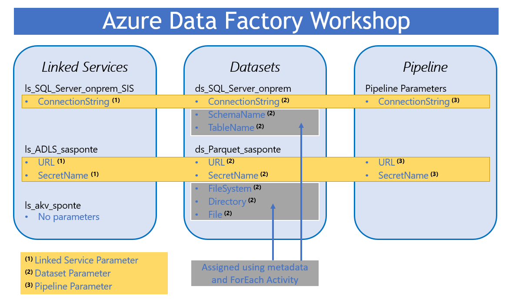

# Metadata driven pipeline

## Introduction
Azure Data Factory (ADF) pipelines can be used to orchestrate the movement and transformation of on-premises  or cloud based data sets [(there are currently over 90 connectors)](https://docs.microsoft.com/en-us/azure/data-factory/connector-overview).  The [Integrate](https://docs.microsoft.com/en-us/azure/synapse-analytics/get-started-pipelines) feature of Azure Syanpse Analytics leverages the same codebase as ADF for creating pipelines to move or transform data.

The goal of this workshop is to provide step-by-step guidance for creating a metadata driven ADF pipeline.  Instead of hard coding source/sink connection strings and datasets, a **Lookup** activity will be used to query a metadata table that contains the information needed to assign parameters used by the pipeline at runtime.  In addition, **Azure Key Vault** will be utilized to store connection strings and other secrets needed to connect to source/sink datasets.

### Azure resources provisioned for this workshop:


### Azure Data Platform:

### Focus areas and resource names used in this workshop:

### Parameters are key to creating reusable pipelines:


## Task List

- [Create Linked services](#Create-Linked-services)
- [Create Datasets](#Create-Datasets)
- [Create Metadata Driven Pipeline](#Create-Metadata-Driven-Pipeline)

### Create Linked services

1. Prior to creating linked services for on-premises data sources a [Self-hosted Integration Runtime](https://docs.microsoft.com/en-us/azure/data-factory/create-self-hosted-integration-runtime) needs to be created:

1. A **Linked Service** needs to be created in order to retrieve secrets from an Azure Key Vault.  Go to *Manage->Linked services* and click **+ New**

1. Enter **azure key** to filter the connections.  Select **Azure Key Vault** and click **Continue**:

1. fill out the **New linked service** properties:

    | Property | Value  |
    |------|------|
    |**Name**  | ls_akv_sponte|
    |**Description**  | Key vault for ADF pipelines|
    |**Base URL**  | https://akv-sponte.vault.azure.net|

    
    You will notice a message box with the name of the **Managed Identity** associated with the ADF you are working in.  There is also a link to documentation on how to grant the ADF Managed Identity access to your Azure Key Vault.
1. Grant **Get and List** Secret permissions to the ADF Managed Identity:


1. A **Linked Service** needs to be created to connect to an on-premises SQL Server Database.  Go to *Manage->Linked services* and click **+ New**

1. Enter **sql server** to filter the connections.  Select **SQL Server** and click **Continue**:

1. fill out the **New linked service** properties:

    | Property | Value  |
    |------|------|
    |**Name**  | ls_SQL_Server_onprem_SIS|
    |**Description**  | Linked service for on-premises SQL Server SIS database|
    |**Connect via integration runtime**  | on-premises-sis|
    |**AKV linked service**  | ls_akv_sponte|
    |**Secret name**  | *need to add a **Parameter** to be able to switch between different databases as needed (for example development and production)*|
    
    
1. Scroll down and click on **+ New** to create a new **ConnectionString** parameter and set the **DEFAULT VALUE** to the name of the secret containing the connection string for the development database:

1. Go back to the **Secret name** property and click on **Add dynamic content**. The dynamic content expression editor window will be shown.  Click on the **ConnectionString** parameter to populate the expression to reference the newly created parameter.  Click **Finish**:

1. All of the required properties to create the new linked service for the on-premises SQL Server database should now be populated.  Click on **Test connection** to ensure the linked service can access the on-premises SQL Server database.  Click **Create** to continue:


### Create Datasets
1. step 1 of task 2 with console window:
    ```console
    az Login
    az Account show
    ```

### Create Metadata Driven Pipeline
1. step 1 of task 2 with console window:
    ```console
    az Login
    az Account show
    ```

## Back to workshop overview: [Introduction to Azure Data Factory Workshop](readme.md)