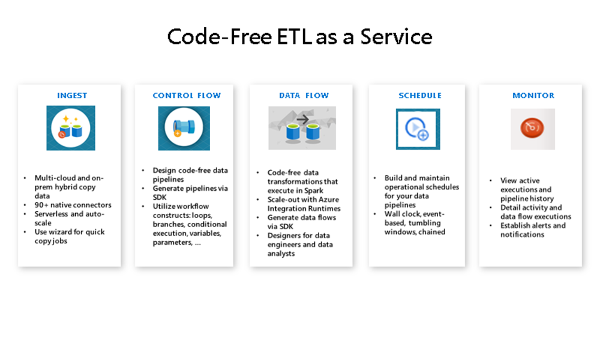

# Metadata driven pipeline

## Introduction


## Task List

- [Create Linked services](#Create-Linked-services)
- [Create Datasets](#Create-Datasets)
- [Create Metadata Driven Pipeline](#Create-Metadata-Driven-Pipeline)

### Create Linked services

1. This is the first step of the first task


### Create Datasets
1. step 1 of task 2 with console window:
    ```console
    az Login
    az Account show
    ```

### Create Metadata Driven Pipeline
1. step 1 of task 2 with console window:
    ```console
    az Login
    az Account show
    ```

## Back to workshop overview: [Introduction to Azure Data Factory Workshop](readme.md)