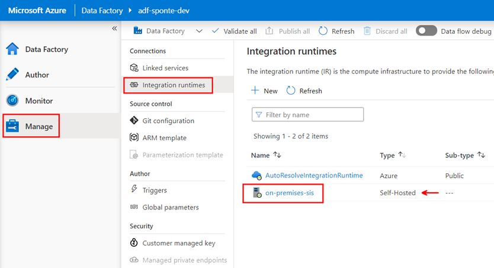

# Metadata driven pipeline

## Introduction
Azure Data Factory (ADF) pipelines can be used to orchestrate the movement and transformation of on-premises  or cloud based data sets [(there are currently over 90 connectors)](https://docs.microsoft.com/en-us/azure/data-factory/connector-overview).  The [Integrate](https://docs.microsoft.com/en-us/azure/synapse-analytics/get-started-pipelines) feature of Azure Syanpse Analytics leverages the same codebase as ADF for creating pipelines to move or transform data.

The goal of this workshop is to provide step-by-step guidance for creating a metadata driven ADF pipeline.  Instead of hard coding source/sink connection strings and datasets, a **Lookup** activity will be used to query a metadata table that contains the information needed to assign parameters used by the pipeline at runtime.  In addition, **Azure Key Vault** will be utilized to store connection strings and other secrets needed to connect to source/sink datasets.

### Azure resources provisioned for this workshop:


### Azure Data Platform:

### Focus areas and resource names used in this workshop:

### Parameters are key to creating reusable pipelines:


## Task List

- [Create Linked services](#Create-Linked-services)
- [Create Datasets](#Create-Datasets)
- [Create Metadata Driven Pipeline](#Create-Metadata-Driven-Pipeline)

### Create Linked services

1. This is the first step of the first task


### Create Datasets
1. step 1 of task 2 with console window:
    ```console
    az Login
    az Account show
    ```

### Create Metadata Driven Pipeline
1. step 1 of task 2 with console window:
    ```console
    az Login
    az Account show
    ```

## Back to workshop overview: [Introduction to Azure Data Factory Workshop](readme.md)