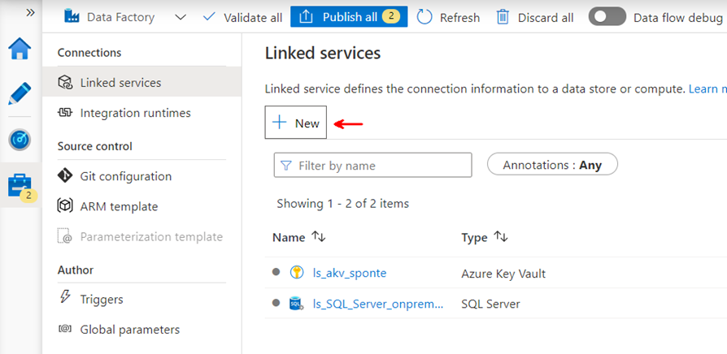
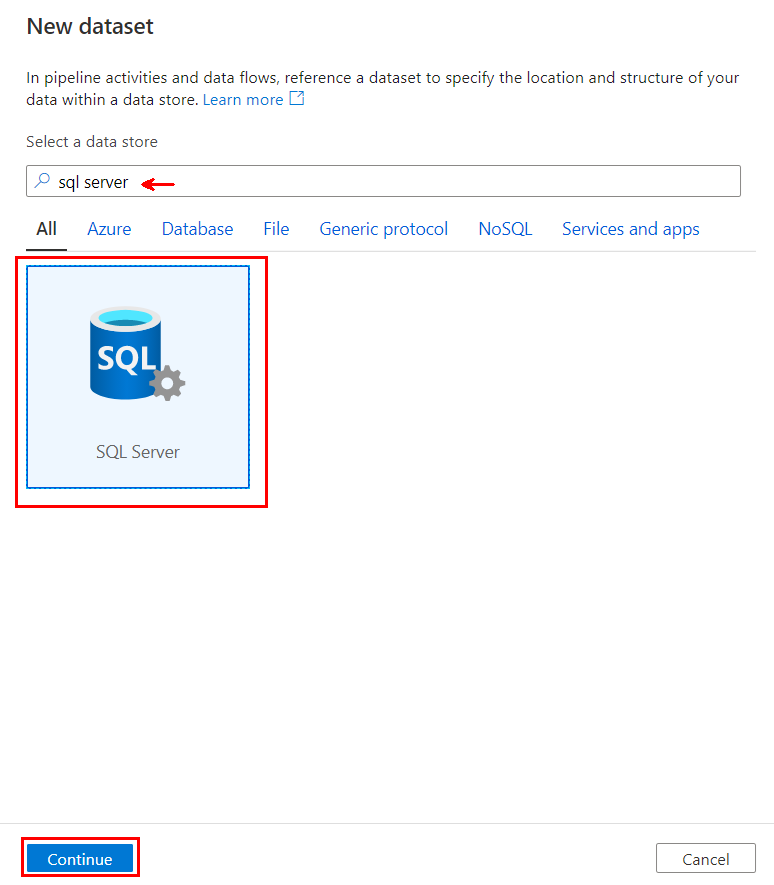

# Metadata driven pipeline

## Introduction
Azure Data Factory (ADF) pipelines can be used to orchestrate the movement and transformation of on-premises  or cloud based data sets [(there are currently over 90 connectors)](https://docs.microsoft.com/en-us/azure/data-factory/connector-overview).  The [Integrate](https://docs.microsoft.com/en-us/azure/synapse-analytics/get-started-pipelines) feature of Azure Syanpse Analytics leverages the same codebase as ADF for creating pipelines to move or transform data.

The goal of this workshop is to provide step-by-step guidance for creating a metadata driven ADF pipeline.  Instead of hard coding source/sink connection strings and datasets, a **Lookup** activity will be used to query a metadata table that contains the information needed to assign parameters used by the pipeline at runtime.  In addition, **Azure Key Vault** will be utilized to store connection strings and other secrets needed to connect to source/sink datasets.

### Azure resources provisioned for this workshop:


### Azure Data Platform:

### Focus areas and resource names used in this workshop:

### Lookup activity is used to query metadata table to drive ForEach:

### Parameters are key to creating reusable pipelines:


## Task List

- [Create Linked services](#Create-Linked-services)
- [Create Datasets](#Create-Datasets)
- [Create Metadata Driven Pipeline](#Create-Metadata-Driven-Pipeline)
- [Metadata Driven Pipeline Resources](#Metadata-Driven-Pipeline-Resources)

### Create Linked services

1. Prior to creating linked services for on-premises data sources a [Self-hosted Integration Runtime](https://docs.microsoft.com/en-us/azure/data-factory/create-self-hosted-integration-runtime) needs to be created:

1. A **Linked Service** needs to be created in order to retrieve secrets from an Azure Key Vault.  Go to *Manage->Linked services* and click **+ New**

1. Enter **azure key** to filter the connections.  Select **Azure Key Vault** and click **Continue**:

1. fill out the **New linked service** properties:

    | Property | Value  |
    |------|------|
    |**Name**  | ls_akv_sponte|
    |**Description**  | Key vault for ADF pipelines|
    |**Base URL**  | https://akv-sponte.vault.azure.net|

    
    
    You will notice a message box with the name of the **Managed Identity** associated with the ADF you are working in.  There is also a link to documentation on how to grant the ADF Managed Identity access to your Azure Key Vault.
1. Grant **Get** and **List** Secret permissions to the ADF Managed Identity:


1. A **Linked Service** needs to be created to connect to an on-premises SQL Server Database.  Go to *Manage->Linked services* and click **+ New**

1. Enter **sql server** to filter the connections.  Select **SQL Server** and click **Continue**:

1. fill out the **New linked service** properties:

    | Property | Value  |
    |------|------|
    |**Name**  | ls_SQL_Server_onprem_SIS|
    |**Description**  | Linked service for on-premises SQL Server SIS database|
    |**Connect via integration runtime**  | on-premises-sis|
    |**AKV linked service**  | ls_akv_sponte|
    |**Secret name**  | *need to add a **Parameter** to be able to switch between different databases as needed (for example development and production)*|

    
1. Scroll down and click on **+ New** to create a new **ConnectionString** parameter and set the **DEFAULT VALUE** to the name of the secret containing the connection string for the development database:

1. Go back to the **Secret name** property and click on **Add dynamic content**. The dynamic content expression editor window will be shown.  Click on the **ConnectionString** parameter to populate the expression to reference the newly created parameter.  Click **Finish**:

1. All of the required properties to create the new linked service for the on-premises SQL Server database should now be populated.  Click on **Test connection** to ensure the linked service can access the on-premises SQL Server database.  Click **Create** to continue:

1. A **Linked Service** needs to be created to connect to an Azure Data Lake.  Go to *Manage->Linked services* and click **+ New**

1. Enter **azure data lake** to filter the connections.  Select **Azure Data Lake Storage Gen2** and click **Continue**:

1. fill out the **New linked service** properties and click **Create**:

    | Property | Value  |
    |------|------|
    |**Name**  | ls_ADLS_sasponte|
    |**Description**  | Linked service for Azure Data Lake|
    |**Connect via integration runtime**  | AutoResolveIntegrationRuntime|
    |**Authentication method**  | Account key|
    |**Account selection method**  | Enter manual|
    |**URL**  | **@linkedService().URL**|
    |**AKV linked service**  | ls_akv_sponte|
    |**Secret name**  | **@linkedService().SecretName**|


    
    
    **NOTE:** The current version of the ADF linked service UI for Azure Data Lake Storaged does not provide an option to create parameters.  The workaround is to specify the expression for the properties to be paramaterized (**URL** for Azure Data Lake Storage Account and **SecretName** for name of the Azure Key Vault secret containing the account key).  The JSON for the linked service can then be edited after creation to include the parameters.
1. The **ls_ADLS_sasponte** linked service should now be available to edit.  Click the **{ }** symble to the right of the linked service name to edit the JSON:

    
1. Add the following JSON below **description** and **annotations** in the **properties** block of the JSON definition as shown and Click **OK**:
    ```console
        "parameters": {
            "URL": {
                "type": "string",
                "defaultValue": "https://saspontedev.dfs.core.windows.net"
            },
            "SecretName": {
                "type": "string",
                "defaultValue": "saspontedev-ak"
            }
        },
    ```
    **NOTE:** The JSON definition block for the parameters includes **defaultValue** assignments.
    
1. All of the **Linked services** needed for the metadata driven pipeline should now be listed.  Click on **Publish all** to publish all of the linked service definitions before continuing to the next step:
    
    
    

### Create Datasets
1. A **Dataset** needs to be created to query the on-premises SQL Server Database.  Go to *Author->Datasets* and click **...** to open the **Actions** drop down menu:
    
1. Select **New dataset**:
    
1. Enter **sql server** to filter the data stores.  Select **SQL Server** and click **Continue**:
    
1. fill out the **New dataset** properties and click **OK**:

    | Property | Value  |
    |------|------|
    |**Name**  | ds_SQL_Server_onprem|
    |**Linked service**  | ls_SQL_Server_onprem_SIS|

    
1. The dataset UI should now be displayed for the new dataset.  The **Properties** pane to the right of the UI can be collapsed by clicking on the middle icon:
    
1. Note that the **ConnectionString** parameter previously defined for the **ls_SQL_Server_onprem_SIS** linked service is automatically surfaced and populated with the default value.  Check the box next to **Edit** underneath the **Table** property to add a box to enter the schema:
    
1. Click **Parameters** to add parameters to the dataset definition:

    
1. Create the following parameters and assign default values for each:

    | NAME | TYPE  | DEFAULT VALUE  |
    |------|------|------|
    |**ConnectionString**  | String | dev-Enrollment-DW-cs|
    |**SchemaName**  | String | INFORMATION_SCHEMA|
    |**TableName**  | String | tables|

    
1. Go back to the **Connection** definition and click within the **VALUE** text box for **ConnectionString**. Click on the **Add dynamic content** link:
    
1. The dynamic content expression editor window will be shown.  Click on the **ConnectionString** parameter to populate the expression to reference the newly created parameter.  Click **Finish**:
    
1. Use the dynamic content expression editor to add parameter references to the **Schema** and **Table** properties. Click **Preview data** to validate the dataset:
    
1. A new window should appear displaying all of the parameters defined for the dataset. The default values should be displayed and can be overwritten.  Click **OK** to open the preview the dataset:
    
1. The **Preview data** window should now be displayed listing a preview of the dataset:
    
1. A **Dataset** needs to be created to query the on-premises SQL Server Database.  Go to *Author->Datasets* and click **...** to open the **Actions** drop down menu. Select **New dataset**:
    
1. Enter **azure data lake** to filter the data stores.  Select **Azure Data Lake Storage Gen2** and click **Continue**:
    
1. Select **Parquet** as the format type and click **Continue**:
    
1. fill out the **New dataset** properties and click **OK**:

    | Property | Value  |
    |------|------|
    |**Name**  | ds_Parquet_sasponte|
    |**Linked service**  | ls_ADLS_sasponte|

    
1. The dataset UI should now be displayed for the new dataset.  Note that the **URL** and **SecretName** parameters previously defined for the **ls_ADLS_sasponte** linked service are automatically surfaced and populated with the default values.  Click **Parameters** to add parameters to the dataset definition:
    
1. Create the following parameters and assign default values for each:

    | NAME | TYPE  | DEFAULT VALUE  |
    |------|------|------|
    |**URL**  | String | https://saspontedev.dfs.core.windows.net|
    |**SecretName**  | String | saspontedev-ak|
    |**FileSystem**  | String | raw|
    |**Directory**  | String | connection_test|
    |**File**  | String | file.parquet|

    
1. Go back to the **Connection** definition and click within the **VALUE** text box for **URL**. Click on the **Add dynamic content** link:
    
1. The dynamic content expression editor window will be shown.  Click on the **URL** parameter to populate the expression to reference the newly created parameter.  Click **Finish**:
    
1. Use the dynamic content expression editor to add parameter references to the **SecretName**, **FileSystem**, **Directory** and **File** properties. Click **Preview data** to validate the dataset:
    
1. All of the **Datasets** needed for the metadata driven pipeline should now be listed.  Click on **Publish all** to publish all of the dataset definitions before continuing to the next step:
    
    

### Create Metadata Driven Pipeline
1. step 1 of task 2 with console window:
    ```console
    az Login
    az Account show
    ```

### Metadata Driven Pipeline Resources
1. step 1 of task 2 with console window:

## Back to workshop overview: [Introduction to Azure Data Factory Workshop](readme.md)