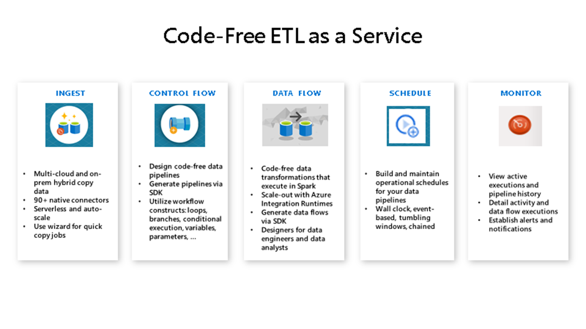

# Introduction to Azure Data Factory Workshop

## Azure Data Factory

In this workshop we will use [Azure Data Factory](https://docs.microsoft.com/en-us/azure/data-factory/introduction) to copy, prepare and enrich data.

Azure Data Factory is a cloud-based ETL and data integration service that allows you to create data-driven workflows for orchestrating data movement and transforming data at scale.  Using Azure Data Factory, you can create and schedule data-driven workflows (called pipelines) that can ingest data from disparate data stores.

### Prerequisites
Access to an Azure Subscription containing the following resources:
- [Azure Data Factory](https://docs.microsoft.com/en-us/azure/data-factory/introduction)
- [Azure Data Lake Storage Gen2](https://docs.microsoft.com/en-us/azure/storage/blobs/data-lake-storage-introduction) 

### Optional
- [Visual Studio Code](https://code.visualstudio.com/Download)
- [Windows Terminal](https://docs.microsoft.com/en-us/windows/terminal/get-started)
- [Azure Storage Explorer](https://azure.microsoft.com/en-us/features/storage-explorer/)

### Provisioning Resources
- [Provision Resource Group](https://docs.microsoft.com/en-us/azure/azure-resource-manager/management/manage-resource-groups-portal)
- [Provision Azure Data Lake Storage Gen2](https://docs.microsoft.com/en-us/azure/storage/blobs/create-data-lake-storage-account)
- [Provision Azure Data Factory](https://docs.microsoft.com/en-us/azure/data-factory/quickstart-create-data-factory-portal)

### Metadata driven pipeline
- [Use Azure Data Factory](metadata-driven-pipeline.md) to:
  - Create Linked services (parameterized)
  - Create Datasets (parameterized)
  - Create Metadata Driven Pipelines

### Mapping Data Flow
- [Use Azure Data Factory Mapping Data Flows](mapping-data-flow.md) to:
  - Develop data transformation logic without writing code
  - Create ETL (extract-transform-load) patterns integrated with Data Factory pipelines
  - Perform in-memory transformations such as:
    - Derived columns
    - Joins
    - Lookups
    - Conditional splits
    - Alter rows
    - And a lot [more](https://docs.microsoft.com/en-us/azure/data-factory/data-flow-transformation-overview)! 

### Consume data from API using Azure Functions
- [Use Azure Data Factory](api-pipeline.md) to:
  - Create Linked Servers
  - Create Web Activity
  - ...

### Additional Resources
- [Azure Data Factory - YouTube Channel](https://www.youtube.com/channel/UC2S0k7NeLcEm5_IhHUwpN0g)
